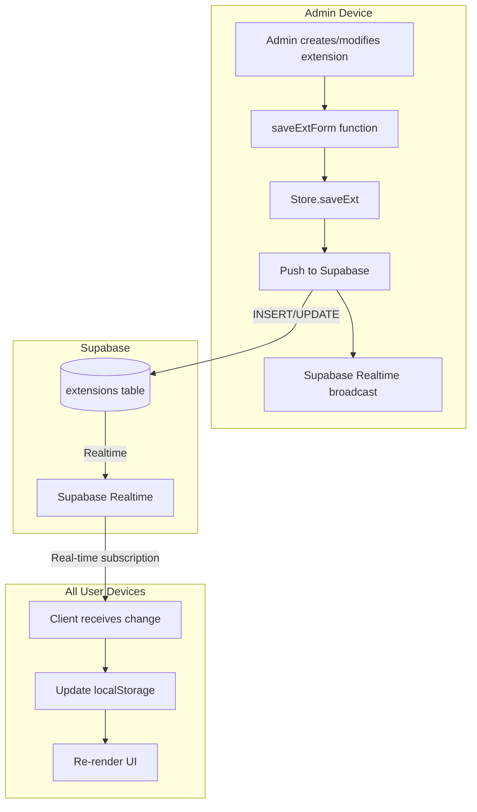

# Real-Time Synchronization Plan

## Executive Summary

This plan outlines the implementation of real-time synchronization for the church report application, enabling all users to see admin-created extensions instantly across all devices.

---

## Current Architecture Analysis

| Component | Current State |
|-----------|---------------|
| **Data Storage** | Supabase (`extensions`, `rapports` tables) |
| **Primary Source** | localStorage (not Supabase) |
| **Sync Direction** | One-way: Supabase → localStorage only |
| **Real-time** | None (polling-based load only) |
| **Extension Save** | [`Store.saveExt()`](src/app/state.ts:111) → localStorage only |

### Key Files Involved
- [`src/app/supabase.ts`](src/app/supabase.ts) - Supabase client and sync logic
- [`src/app/state.ts`](src/app/state.ts) - localStorage-based state management
- [`src/app/index.ts`](src/app/index.ts:1467) - Extension form save handler

---

## Recommended Solution Architecture



### Core Changes

1. **Two-way sync**: Push changes TO Supabase when admin saves
2. **Real-time subscriptions**: Listen for changes from Supabase
3. **Optimistic updates**: Update UI immediately, sync in background

---

## Implementation Steps

### Step 1: Modify Supabase Client for Real-time
- [ ] Add Supabase Realtime subscription support in [`src/app/supabase.ts`](src/app/supabase.ts)
- [ ] Create `subscribeToExtensions()` function for real-time updates

### Step 2: Update Extension Save Logic
- [ ] Modify [`Store.saveExt()`](src/app/state.ts:111) to push to Supabase
- [ ] Add `saveExtToSupabase()` function
- [ ] Handle conflicts (last-write-wins)

### Step 3: Add Real-time Listeners
- [ ] Initialize subscriptions on app startup in [`src/app/index.ts`](src/app/index.ts)
- [ ] Listen for `INSERT`, `UPDATE`, `DELETE` events on extensions table
- [ ] Auto-update localStorage and re-render when changes detected

### Step 4: Configure Vercel Deployment
- [ ] Update `vite.config.ts` for Vercel (add `vercel` plugin or adapter)
- [ ] Configure environment variables in Vercel project
- [ ] Set up automatic deployments from git

### Step 5: Supabase Configuration (Dashboard)
- [ ] Enable Realtime on `extensions` table
- [ ] Set up Row Level Security (RLS) policies:
  - Public read access (all users can read)
  - Admin-only write access (only authenticated admin can write)

---

## File Modifications Summary

| File | Changes |
|------|---------|
| `src/app/supabase.ts` | Add `subscribeToExtensions()`, `saveExtToSupabase()`, `saveRapToSupabase()` |
| `src/app/state.ts` | Modify `saveExt()`, `delExt()` to sync with Supabase |
| `src/app/index.ts` | Initialize real-time subscriptions on startup |
| `vite.config.ts` | Configure for Vercel deployment |
| `.env.local` | Keep for local dev, add to Vercel project settings |

---

## Environment Variables Required

For Vercel deployment, add these in Vercel Project Settings:

```
VITE_SUPABASE_URL=https://ynkxxlclrvjtzunxbejo.supabase.co
VITE_SUPABASE_ANON_KEY=eyJhbGciOiJIUzI1NiIsInR5cCI6IkpXVCJ9...
```

---

## Benefits of This Approach

1. **Instant sync**: All users see changes within milliseconds
2. **Offline support**: localStorage fallback works when offline
3. **Scalable**: Supabase handles concurrent connections
4. **No extra infrastructure**: Uses existing Supabase Realtime feature
5. **Vercel-ready**: Simple Vercel configuration required

---

## Alternative: Extend to Rapports

If you later want real-time sync for **rapports** as well:

1. Apply same pattern to [`Store.saveRap()`](src/app/state.ts:141)
2. Subscribe to `rapports` table changes
3. This would enable extension users to see report updates in real-time

---

## Questions Before Implementation

1. Should I also implement real-time sync for **rapports** (not just extensions)?
2. Do you need authentication for the Supabase write operations, or should it remain open for the anon key?
3. Do you have Vercel account set up, or should we create one?

---

*Plan created for: churchreport-eic*
*Supabase project: ynkxxlclrvjtzunxbejo*
